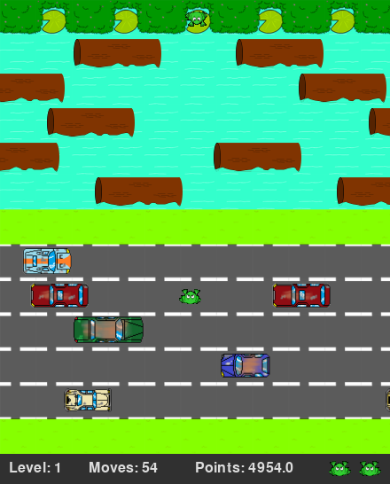

# frogger

An extension to [jgubert](https://github.com/jgubert/)'s Python frogger game that can be integrated with [OpenAI's Gym](https://gym.openai.com/) (Gym) via [PyGame Learning Environment](https://github.com/ntasfi/PyGame-Learning-Environment) (PLE). 

This extension allows frogger to be treated as a *Reinforcement Learning* problem and solved using any standard algorithm.

Tested with *Python 3.5* (*gym v0.10.9* and *pygame v1.9.4*)

# Task Description

The agent controlls frogs trying to cross a road and then a river in order to reach an available water lilly. To cross to the other side, the frog has to move upwards, avoiding cars on the road and using the platforms floating on the river. It also has a limit on the number of time-steps (actions it can perform) to move each frog into a water lilly. The interval with which cars and platforms appear is *randomized*.

The agent has a *limited number of lives* available. When a frog hits a car, goes into the water, or the maximum number of time-steps has been reached, the agent looses a life. 

A certain number of frogs have to reach water lillies for the game to achieve a *new level*. When that occurs, the speed at which the cars and platforms move gets increased.

In this task, an *episode* ends when the agent looses all lives. As long as the agent keeps crossing all frogs within the available number of time-steps, the game does not terminate.

# Parameters

The following parameters can be defined in both the PLE and Gym game interfaces:

- **actions:** customizable dictionary of the agent's actions in the form `(action_name:key)`. Use the keys for each desired direction according to the constants defined in `frogger_ple.py`
- **rewards:** customizable dictionary of the agent's rewards in the form `(reward_name:value)`. 
  Use the names for each reward according to the constants defined in `frogger_ple.py`
- **lives:** the number of lives of the agent
- **speed:** the initial speed of the game (increased when agent passes a new level)
- **level:** the initial level at which the game starts
- **num_arrived_frogs:** the number of frogs that have to reach a water lilly for the agent to pass a new level 
- **max_steps:** the maximum number of steps (actions) that the agent has to put each frog in a water lilly
- **show_stats:** whether to show the game information at the bottom of the screen

# Examples

The following scripts are available to be run (`python script.py`):

- `random_ple.py`: a random agent using the PLE interface
- `random_gym.py`: a random agent using the Gym interface
- `manual_gym.py`: a keyboard-controlled agent using the Gym interface